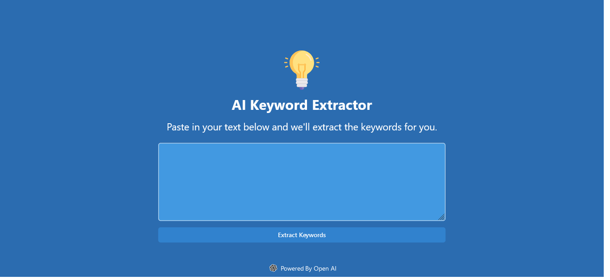

# Keyword Extractor


Keyword Extractor Application is uses AI to analyze text and extract the best keywords. It was created using HTML5, ChakraUI and React.js.

## Prerequisites

Before you can run this project, you need to have the following installed:

- Node.js (version 18.0 or later)

## Installation

To install this project, follow these steps:
Clone the repository using `git`

```
git clone https://github.com/Prakashdeveloper03/Keyword-Extractor.git
```

Navigate to the root directory of the project

```
cd <directory_name>
```

To install all the dependencies

```
pnpm install
```

Rename `.env.example` to `.env` and add your API key. You can get your key at [openai](https://platform.openai.com/account/api-keys).

```
VITE_OPENAI_API_KEY='ADD_YOUR_KEY_HERE'
```

**Important:** Your API key is not secure as there is no backend. If you decide to use this tool in production, you should add a backend to it and store the API key there.<br>
Run the app

```
npm run dev
```

## Screenshot


